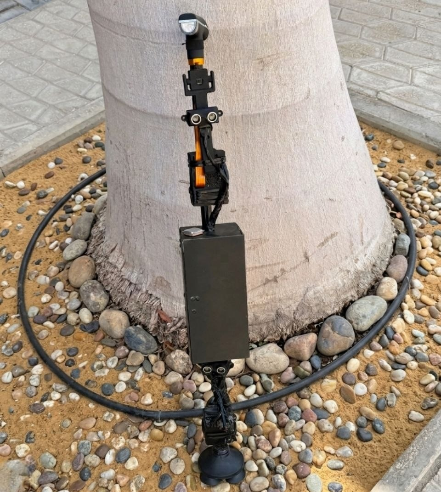
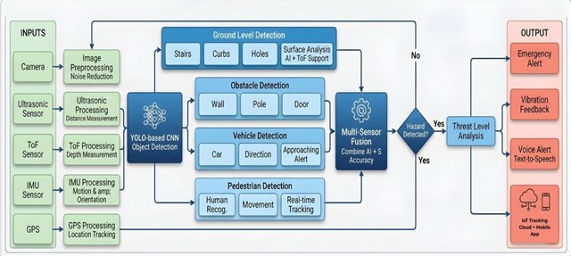
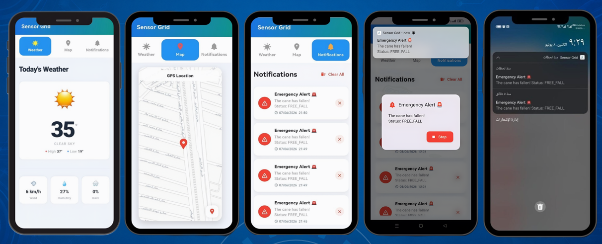

<div align="center">

# 🦯 Smart Blind Stick
### Safe and Independent Mobility Powered by AI, IoT & Object Detection

[](https://www.python.org/)
[](https://flutter.dev/)
[](https://ultralytics.com/)
[](https://www.raspberrypi.com/)
[](https://supabase.com/)
[](LICENSE)

<br/>

> **Graduation Project — Faculty of Information Systems and Computer Science - October 6 University**  
> Supervised by Dr. Nagwa Yaseen · Dr. Mohamed Eassa

<br/>

<!-- SCREENSHOT: Hero banner showing the physical Smart Blind Stick held by a user,
     or a composite image showing the stick + mobile app + detection overlay side by side.
     Place this image at: assets/images/banner.png -->


</div>

---

## 📋 Table of Contents

- [Overview](#-overview)
- [Key Features](#-key-features)
- [System Architecture](#-system-architecture)
- [Hardware Components](#-hardware-components)
- [Software Stack](#-software-stack)
- [Detection Performance](#-detection-performance)
- [Project Structure](#-project-structure)
- [Getting Started](#-getting-started)
  - [Hardware Setup](#hardware-setup)
  - [Raspberry Pi (Backend)](#raspberry-pi-backend)
  - [Flutter Mobile App](#flutter-mobile-app)
- [Configuration](#-configuration)
- [How It Works](#-how-it-works)
- [Mobile App — Sensor Grid](#-mobile-app--sensor-grid)
- [Cloud & Database](#-cloud--database)
- [Results & Evaluation](#-results--evaluation)
- [Future Work](#-future-work)
- [Team](#-team)
- [License](#-license)

---

## 🌟 Overview

More than **2.2 billion people** worldwide suffer from visual impairment. Traditional white canes detect obstacles only through physical contact and cannot identify stairs, holes, moving vehicles, or ground-level hazards — leaving users exposed to daily dangers.

The **Smart Blind Stick** is a comprehensive intelligent assistive system that integrates **Artificial Intelligence (AI)**, **Internet of Things (IoT)**, and **multi-sensor fusion** to give visually impaired users a real-time, awareness of their environment. It detects obstacles, recognizes ground hazards, tracks location, alerts caregivers during emergencies, and communicates everything through voice feedback — all in real time.

<!-- SCREENSHOT: A before/after comparison or a clean product photo of the assembled stick.
     Place at: assets/images/overview.jpg -->
---

## ✨ Key Features

| Feature | Description |
|---|---|
| 🎯 **AI Object Detection** | YOLO v11s detects people, vehicles, animals, and everyday objects at 86.7% accuracy |
| 🔊 **Real-Time Voice Feedback** | Spoken alerts via Bluetooth AirPods with priority queuing |
| 📡 **Dual Ultrasonic Sensing** | Two HC-SR04 sensors for wide-angle obstacle detection within 50 cm |
| 🕳️ **Ground Hazard Detection** | VL53L1X ToF sensor detects holes, curbs, and steps with 87.2% accuracy |
| 🤸 **Fall Detection** | MPU-6050 IMU detects and confirms falls with 98% accuracy, with instant buzzer + cloud alert |
| 🗺️ **GPS Tracking** | Real-time location shared with caregivers via cloud dashboard |
| 🌤️ **Live Weather Integration** | Current weather fetched automatically at each GPS fix |
| 📲 **Caregiver Mobile App** | Flutter app ("Sensor Grid") with live map, notifications, and weather |
| ☁️ **Cloud Backend** | All events logged to Supabase in real time |
| 🔋 **Lightweight Design** | Runs entirely on Raspberry Pi 5 with long battery life |

---

## 🏗️ System Architecture

<!-- SCREENSHOT: The full system architecture diagram from your presentation (Slide 6 / your architecture slide).
     Export it as a clean PNG and place at: assets/images/architecture.png -->


The system is built on a **layered multi-sensor AI architecture**:

```
┌──────────────────────────────────────────────────────────────┐
│                     SENSOR LAYER                             │
│  [Camera]  [Ultrasonic x2]  [ToF]  [MPU-6050]  [GPS]         │
└────────────────────────┬─────────────────────────────────────┘
                         │
┌────────────────────────▼─────────────────────────────────────┐
│                 PROCESSING LAYER (Raspberry Pi 5)            │
│   YOLO Inference  │  Sensor Fusion  │  Fall Detection        │
│   Voice Engine    │  GPS+Weather    │  Bluetooth Audio       │
└────────────────────────┬─────────────────────────────────────┘
                         │
┌────────────────────────▼─────────────────────────────────────┐
│                    CLOUD LAYER (Supabase)                    │
│   gps_locations table  │  mpu_fall_detected table            │
└────────────────────────┬─────────────────────────────────────┘
                         │
┌────────────────────────▼─────────────────────────────────────┐
│               CAREGIVER APP (Flutter — Sensor Grid)          │
│   Live Map  │  Fall Notifications  │  Weather Dashboard      │
└──────────────────────────────────────────────────────────────┘
```

All sensor threads run **concurrently and independently** using Python's `threading` module. A shared `i2c_lock` prevents I2C bus conflicts, and thread-safe queues ensure voice alerts are delivered in order of priority.

---

## 🔧 Hardware Components

<!-- SCREENSHOT: A labeled photo of all hardware components laid out, or a close-up of
     the assembled electronics on the stick. Place at: assets/images/hardware.jpg -->

| Component | Model | Purpose |
|---|---|---|
| **Main Controller** | Raspberry Pi 5 | Central processing unit |
| **Camera** | Raspberry Pi Camera Module | Object detection input |
| **Ultrasonic Sensors** | HC-SR04 × 2 | Obstacle detection (front + side) |
| **Time-of-Flight Sensor** | VL53L1X (ST) | Ground hazard depth sensing |
| **IMU / Accelerometer** | MPU-6050 | Fall detection & orientation |
| **GPS Module** | Neo-6M | Real-time location tracking |
| **Audio Output** | Bluetooth AirPods / Earbuds | Voice feedback delivery |
| **Alert Buzzer** | Active Buzzer | Emergency audio alert |

### GPIO Pin Mapping

| Signal | GPIO Pin |
|---|---|
| Ultrasonic 1 — TRIG | GPIO 23 |
| Ultrasonic 1 — ECHO | GPIO 24 |
| Ultrasonic 2 — TRIG | GPIO 17 |
| Ultrasonic 2 — ECHO | GPIO 27 |
| Buzzer | GPIO 18 |
| MPU-6050 | I2C (SDA/SCL) |
| VL53L1X ToF | I2C (SDA/SCL) |
| GPS | UART `/dev/serial0` |

---

## 💻 Software Stack

### Raspberry Pi (Python)

| Library | Purpose |
|---|---|
| `ultralytics` (YOLO v11s) | Real-time object detection |
| `picamera2` | Camera capture |
| `opencv-python` | Frame processing & display HUD |
| `lgpio` | GPIO control for sensors & buzzer |
| `smbus2` | I2C communication (MPU-6050) |
| `adafruit_vl53l1x` | ToF sensor driver |
| `pynmea2` + `pyserial` | GPS NMEA parsing |
| `supabase-py` | Cloud database client |
| `requests` | HTTP for weather API & Supabase REST |
| `espeak` | Text-to-speech voice synthesis |
| `pulseaudio` / `paplay` | Bluetooth audio routing |

### Mobile App (Flutter / Dart)

| Package | Purpose |
|---|---|
| `flutter_map` + `latlong2` | Interactive map display |
| `geolocator` | Device GPS location |
| `supabase_flutter` | Real-time database updates |
| `flutter_local_notifications` | Push alerts for fall events |
| `audioplayers` | Emergency audio playback |
| `dio` | HTTP client |

---

## 📊 Detection Performance

<!-- SCREENSHOT: The performance results table/chart from your presentation (Slide 34-35).
     Or a real photo of the detection in action — camera view with bounding boxes.
     Place at: assets/images/results.png -->

| Module | Function | Accuracy |
|---|---|---|
| 🎯 YOLO AI Camera | Object Detection | **86.7%** |
| 📡 Ultrasonic Sensors | Obstacle Detection | **86.6%** |
| 🕳️ VL53L1X ToF Sensor | Ground Hazard Detection | **87.2%** |
| 🤸 MPU-6050 | Fall Detection | **98%** |
| 🗺️ Neo-6M GPS | Location Tracking | **3–5 m error** |
| 🔊 Audio Feedback System | Voice Alert Delivery | **> 95% reliability** |

---

## 📁 Project Structure

```
smart-blind-stick/
│
├── smart_stick.py          # Main Raspberry Pi application
├── .gitignore              # Ignored files
├── LICENSE                 # MIT License for team graduation project
│
├── grad_proj/              # Flutter Mobile App (Sensor Grid)
│   ├── lib/
│   │   ├── core/
│   │   │   ├── resources/
│   │   │   │   └── app_colors.dart
│   │   │   └── widgets/
│   │   │       └── custom_appbar.dart
│   │   └── features/
│   │       ├── home_screen/
│   │       │   └── presentation/
│   │       │       └── home_screen.dart        # Main navigation shell
│   │       └── pages/
│   │           ├── dashboard/
│   │           │   └── presentation/
│   │           │       ├── weather_screen.dart  # Weather data view
│   │           │       └── widgets/
│   │           ├── map/
│   │           │   └── presentation/
│   │           │       ├── map_screen.dart      # GPS live map
│   │           │       └── widgets/
│   │           │           └── map_body.dart
│   │           └── trends/
│   │               └── presentation/
│   │                   └── notifications_screen.dart # Fall alerts
│   ├── pubspec.yaml
│   └── assets/
│       ├── images/
│       └── sounds/
│           └── emergency_alert.mp3
│
└── assets/                  # Project assets              
    └── hardware_components/
    └── sounds/
```

---

## 🚀 Getting Started

### Prerequisites

- Raspberry Pi 5 (4GB+ RAM recommended)
- All hardware components listed above
- Python 3.11+
- Flutter SDK 3.x
- A Supabase project

### Hardware Setup

1. Connect the HC-SR04 sensors to the GPIO pins listed in the pin mapping table above.
2. Wire the MPU-6050 and VL53L1X to the I2C bus (SDA = GPIO 2, SCL = GPIO 3).
3. Connect the GPS module to the UART port (`/dev/serial0`). Enable serial in `raspi-config` and **disable the serial console**.
4. Connect the active buzzer to GPIO 18.
5. Pair your Bluetooth earbuds/AirPods before running the system.

<!-- SCREENSHOT: A wiring diagram or breadboard/PCB photo showing the connections.
     Place at: assets/images/wiring.jpg -->

---

### Raspberry Pi (Backend)

#### 1. Clone the repository

```bash
git clone https://github.com/YOUR_USERNAME/smart-blind-stick.git
cd smart-blind-stick
```

#### 2. Install system dependencies

```bash
sudo apt update && sudo apt install -y \
    python3-pip \
    espeak \
    pulseaudio \
    pulseaudio-module-bluetooth \
    libgpiod2
```

#### 3. Install Python dependencies

```bash
pip3 install \
    ultralytics \
    picamera2 \
    opencv-python \
    lgpio \
    smbus2 \
    adafruit-circuitpython-vl53l1x \
    pynmea2 \
    pyserial \
    supabase \
    requests \
    numpy
```

#### 4. Configure Supabase credentials


Open `Smart_Stick.py` and update the following constants with your own Supabase project values:

```python
SUPABASE_URL   = "https://your-project.supabase.co"
SUPABASE_KEY   = "your-anon-key"
SUPABASE_TABLE = "mpu_fall_detected"
```

#### 5. Set up Supabase tables

Run the following SQL in your Supabase SQL editor:

```sql
-- Fall detection events
CREATE TABLE mpu_fall_detected (
    id              BIGSERIAL PRIMARY KEY,
    created_at      TIMESTAMPTZ DEFAULT NOW(),
    magnitude       FLOAT,
    status          TEXT,
    fall_detected   BOOLEAN,
    buzzer_state    TEXT,
    confirm_time    FLOAT,
    stable_time     FLOAT
);

-- GPS & weather log
CREATE TABLE gps_locations (
    id           BIGSERIAL PRIMARY KEY,
    created_at   TIMESTAMPTZ DEFAULT NOW(),
    lat          FLOAT,
    lng          FLOAT,
    temperature  INT,
    humidity     INT,
    wind_speed   FLOAT,
    weather_code INT,
    temp_max     INT,
    temp_min     INT
);
```

#### 6. Download the YOLO model

```bash
# The model downloads automatically on first run, or pre-download with:
python3 -c "from ultralytics import YOLO; YOLO('yolo11s.pt')"
```

#### 7. Run the system

```bash
python3 Smart_Stick.py
```

The system will:
1. Initialize GPIO and audio
2. Detect and connect to Bluetooth audio
3. Calibrate the ToF sensor (hold the cane normally for 2 seconds)
4. Load the YOLO model and warm it up
5. Start all sensor threads and begin real-time detection

Press **`Q`** or **`ESC`** to shut down gracefully.

---

### Flutter Mobile App


#### 1. Navigate to the app directory

```bash
cd grad_proj
```

#### 2. Install Flutter dependencies

```bash
flutter pub get
```

#### 3. Configure Supabase in the app

Update `lib/core/services/` with your Supabase URL and anon key (or set them as environment variables).

#### 4. Run on Android / iOS

```bash
flutter run
```

#### 5. Build a release APK

```bash
flutter build apk --release
```

---

## ⚙️ Configuration

All tuneable parameters are centralized in the `Config` dataclass at the top of `Smart_Stick.py`:

```python
@dataclass(frozen=True)
class Config:
    capture_resolution:     (1280, 960)    # Camera capture size
    display_resolution:     (1280, 960)    # OpenCV display size
    yolo_model:             "yolo11s.pt"   # YOLO model variant
    confidence_threshold:   0.40           # Minimum detection confidence
    frame_skip:             3              # Run inference every N frames
    announcement_cooldown:  5.0            # Seconds between repeat alerts
    speech_rate:            "145"          # espeak words-per-minute
    speech_volume:          "180"          # espeak amplitude (0-200)
    speech_pitch:           "50"           # espeak pitch (0-99)
```

| Constant | Default | Description |
|---|---|---|
| `ULTRASONIC_THRESHOLD_CM` | `50` | Buzzer triggers below this distance |
| `FALL_THRESHOLD` | `0.85` | Acceleration magnitude threshold for fall |
| `CONFIRM_TIME` | `1.0 s` | How long fall must persist before alert |
| `STABLE_TIME` | `1.0 s` | How long normal must persist before reset |
| `TOF_HOLE_THRESHOLD` | `8 cm` | Depth above baseline = hole |
| `TOF_CURB_THRESHOLD` | `6 cm` | Depth below baseline = curb |
| `TOF_ALERT_COOLDOWN` | `1.5 s` | Minimum gap between ground alerts |

---

## 🔍 How It Works

### Concurrent Thread Architecture

The main process spawns six independent daemon threads, each handling one subsystem:

```
Main Thread ──────────────────────────────────────────────────────►
     │
     ├─► [Camera Thread]          Captures frames at ~40 FPS
     │
     ├─► [YOLO Inference Thread]  Runs detection every 3rd frame
     │                            Parses boxes → Detection dataclass
     │
     ├─► [Ultrasonic Thread]      Polls 2 sensors every 300ms
     │                            Drives buzzer for obstacles < 50cm
     │
     ├─► [ToF Thread]             50ms polling loop with median filter
     │                            Dynamic baseline auto-calibration
     │                            Hole / Curb streak confirmation
     │
     ├─► [MPU6050 Fall Thread]    200ms polling loop
     │                            State machine: NORMAL → FALLEN → RECOVERED
     │                            Async Supabase insert on fall event
     │
     ├─► [GPS Weather Thread]     NMEA serial parsing every 3s
     │                            Fetches Open-Meteo weather on each fix
     │                            Logs to Supabase gps_locations
     │
     └─► [Voice Engine Thread]    Priority queue (max 2 items)
                                  espeak → PulseAudio → Bluetooth sink
```

### ToF Adaptive Baseline

The ToF sensor uses a **rolling median baseline** that adapts to the ground surface as the user walks. Two thresholds trigger alerts:

- **Hole detected**: distance exceeds `baseline + 8 cm` for ≥ 2 consecutive readings
- **Curb detected**: distance drops below `baseline − 6 cm` for ≥ 2 consecutive readings
- **Streak overflow (40 readings)**: system adapts to the new ground level automatically

### Fall Detection State Machine

```
NORMAL ──[AY < 0.85 for 1.0s]──► FALLEN ──[AY ≥ 0.85 for 1.0s]──► RECOVERED
            (buzzer ON, alert)                   (buzzer OFF, log)
```

### YOLO Object Announcement

Objects are sorted by priority (danger class first, then confidence). Each label has a per-label cooldown of **5 seconds** to prevent alert fatigue. Only objects that are `close` or `very close` (based on bounding box height ratio) trigger audio announcements:

| Box Height Ratio | Distance Label | Announced? |
|---|---|---|
| > 70% of frame | Very Close | ✅ Always |
| > 40% | Close | ✅ If priority or non-priority close |
| > 20% | Nearby | ❌ Silent |
| ≤ 20% | Far Away | ❌ Silent |

---

## 📱 Mobile App — Sensor Grid

<!-- SCREENSHOT: 3 side-by-side screenshots of the app: Map screen · Notifications screen · Weather screen.
     Place at: assets/images/app_screenshots.png -->


The **Sensor Grid** Flutter app gives caregivers a real-time window into the user's environment:

**Map Screen** — Displays live GPS location markers pulled from Supabase. Uses `flutter_map` with `flutter_map_marker_cluster` for grouped markers when many readings are available.

**Notifications Screen** — Real-time fall event feed. When a fall is logged to Supabase, the app receives an instant update and plays `emergency_alert.mp3` through the device speaker. Uses `flutter_local_notifications` for background alerts.

**Weather Screen** — Shows current weather at the user's location: temperature, min/max, humidity, wind speed, and a human-readable weather description derived from the WMO weather code.

---

## ☁️ Cloud & Database

All data is stored in **Supabase** (PostgreSQL) with real-time subscriptions:

### `mpu_fall_detected` Table

| Column | Type | Description |
|---|---|---|
| `id` | bigint | Auto-increment primary key |
| `created_at` | timestamptz | Event timestamp |
| `magnitude` | float | Acceleration vector magnitude |
| `status` | text | `FREE_FALL` or `NORMAL` |
| `fall_detected` | boolean | True on fall events |
| `buzzer_state` | text | `ON` or `OFF` |
| `confirm_time` | float | Seconds to confirm fall |
| `stable_time` | float | Seconds to confirm recovery |

### `gps_locations` Table

| Column | Type | Description |
|---|---|---|
| `id` | bigint | Auto-increment primary key |
| `created_at` | timestamptz | Log timestamp |
| `lat` / `lng` | float | GPS coordinates |
| `temperature` | int | °C at user's location |
| `humidity` | int | Relative humidity % |
| `wind_speed` | float | km/h |
| `weather_code` | int | WMO weather interpretation code |
| `temp_max` / `temp_min` | int | Daily high/low |

---

## 📈 Results & Evaluation

Testing was conducted in **both indoor and outdoor environments** under different lighting conditions and with various obstacle types. The system operated in real time throughout all tests.

<!-- SCREENSHOT: A photo from actual testing — user holding the stick in an outdoor environment,
     or the OpenCV HUD window showing live detection with bounding boxes and sensor readings.
     Place at: assets/images/testing.jpg -->

### Summary

```
┌────────────────────────────────────┬──────────────┐
│ Evaluation Metric                  │ Result       │
├────────────────────────────────────┼──────────────┤
│ Object Detection Accuracy          │ 86.7%        │
│ Obstacle Detection Accuracy        │ 86.6%        │
│ Ground Hazard Detection Accuracy   │ 87.2%        │
│ Fall Detection Accuracy            │ 95 – 98%     │
│ GPS Tracking Accuracy              │ 3 – 5 meters │
│ Audio Alert Reliability            │ > 95%        │
└────────────────────────────────────┴──────────────┘
```

---

## 🔮 Future Work

- **Lightweight AI models** — Explore MobileNet-SSD or EfficientDet for faster inference on edge hardware
- **Larger & diverse dataset** — Include varied lighting conditions, night scenes, and weather types for improved robustness
- **Improved GPS accuracy** — Integrate A-GPS/D-GPS with IMU-based dead reckoning
- **Indoor positioning** — Wi-Fi fingerprinting for GPS-denied environments
- **AI accelerators** — Offload inference to Google Coral TPU or NVIDIA Jetson Nano
- **Bone-conduction audio** — Replace earbuds with bone-conduction headphones to keep ears open to ambient sound
- **Advanced haptic feedback** — Multi-point vibration motor patterns for directional guidance
- **Real-world user testing** — Iterative improvements with actual visually impaired users

---

## 👥 Team

| # | Name
|---|---|
| 1 | Yousef Ibrahem Ramadan
| 2 | Ibrahim Saad Ibrahim
| 3 | Mohamed Ahmed Shafic
| 4 | Bola Wagdy Hosny
| 5 | Beshoy Safwat Gendy
| 6 | Mechael Bassem Nahamia
| 7 | Youssef Shebl Mohamed

**Supervisors:**
- Dr. Nagwa Yaseen — Assistant Professor, Information Systems Department
- Dr. Mohamed Eassa — Assistant Professor, Computer Science Department
- Eng. Mohamed Kamal — Co-Supervisor

---

## 📄 License

This project is licensed under the MIT License — see the [LICENSE](LICENSE) file for details.